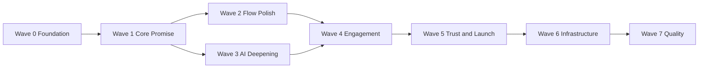

# GlowLogic Production Roadmap

Last updated: 2026-06-13

Master tracker for product improvements, feature delivery, and public launch.

**Deployment stack:** Supabase (database) · Render (backend) · Netlify (frontend)

**Note:** Products will be added manually via the admin panel — no seed/catalog work needed in this plan.

---

## Current Status

**MVP complete.** Auth, product catalog, routines, conflict detection, streaks, challenges, admin panel, landing page, and AI chat all work locally.

**Primary gap:** Marketing promises (compatibility scoring, trigger checking) are not yet visible in the product UI. Navigation, trust pages, and production infrastructure are incomplete.

---

## Product Assessment (outsider review)

### Scores

| Dimension | Score | Summary |
|-----------|-------|---------|
| Ease of use | 6.5/10 | Core flows work; navigation is inconsistent; promised features missing on product pages |
| Purpose clarity | 8/10 | Landing page clearly explains value — ingredient intelligence, conflict detection, personalised advice |
| Legitimacy | 7/10 | Strong visual identity and real functionality; held back by trust gaps and over-promising |

### What works well

- Landing page communicates purpose within seconds
- Cohesive Bloom design system — feels like a wellness startup, not a template
- Ingredient list with hover tooltips on product detail is genuinely useful
- Routine builder + conflict alerts is the **standout differentiator**
- AI chat widget fits the brand and adds value
- Admin CMS enables real content management without code changes

### What hurts usability & trust

| Issue | Impact |
|-------|--------|
| Landing promises compatibility scoring — not shown on product cards | Over-promising |
| Product detail invites signup to check triggers — logged-in users still see no trigger flags | Broken core promise |
| Inconsistent navigation (`/products` vs `/dashboard` show different links) | Users get lost |
| Login redirects to `/products`, not onboarding | New users skip profile setup |
| No "Add to routine" from product detail | Catalog and routine feel disconnected |
| Silent `catch {}` blocks across pages | Failures look like empty/broken UI |
| No privacy, terms, password reset, or medical disclaimer | Not launch-ready for public |
| Mobile headers cram 4–5 links with no hamburger/bottom nav | Poor mobile UX |
| Streak check-ins aren't tied to routine usage | Gamification feels arbitrary |

### Legitimacy verdict

Feels like a **credible beta** someone would try from a link — not yet something strangers bookmark daily. Closing the trigger/scoring gap + unified nav + trust pages moves it to "real product."

---

## Implementation Plan

Work in **waves**. Complete each wave before moving on — later waves depend on earlier foundations.

```
Wave 0  Foundation          Shared layout, toasts, skeletons, error handling
Wave 1  Core Promise       Scoring, triggers, alternatives, onboarding
Wave 2  Flow Polish        Add-to-routine, verdict banner, glossary, compare, filters
Wave 3  AI Deepening        Catalog-aware AI, product context, routine review
Wave 4  Engagement          Smarter streaks, tips, favorites, templates, weekly report
Wave 5  Trust & Launch      Legal pages, password reset, landing stats, share routine, email
Wave 6  Infrastructure       Deploy Supabase + Render + Netlify, security hardening
Wave 7  Quality             Tests, CI, monitoring
```

### Wave dependency map



### Suggested schedule

| Week | Focus | Exit criteria |
|------|-------|---------------|
| 1 | Wave 0 + Wave 1 backend | Scoring API live; triggers API live |
| 2 | Wave 1 frontend | Product pages show scores + trigger flags; onboarding wizard |
| 3 | Wave 2 | Add-to-routine, glossary, compare, toasts everywhere |
| 4 | Wave 3 | AI knows catalog; product + routine AI actions |
| 5 | Wave 4 | Favorites, templates, smarter streaks, dashboard tips |
| 6 | Wave 5 + Wave 6 | Trust pages, password reset, deploy to Supabase/Render/Netlify |
| 7 | Wave 7 | Tests, CI, error tracking |

---

## Wave 0 — Foundation

Goal: Shared infrastructure every feature builds on.

### 0.1 Shared layout & navigation

- [x] Create `AppLayout` component with consistent header
- [x] Logged-in nav: 🔍 Products · ✨ Routine · 🏠 Activity (`/challenges`) · 👤 Profile (icon only) · 🚪 Log out
- [x] Guest nav: Products · Sign in · Get Started
- [x] Mobile bottom tab bar (4 tabs + icon-only profile)
- [x] Apply layout to all authenticated pages (replace per-page headers)
- [x] Logo always links to `/` (home page) from every page

### 0.2 Feedback & loading

- [x] Toast notification system (success / error / info)
- [x] Replace silent `catch {}` with toast errors on all user actions
- [x] Loading skeletons on Products, Product Detail, Activity, Routine, Profile
- [x] Empty states with clear CTAs (no products, no triggers, no routine slots)

### 0.3 Error handling

- [x] React error boundary wrapping app routes
- [x] Consistent API error messages surfaced to user

---

## UX Revisions (2026-06-13)

Post–Wave 0 improvements based on user feedback:

### Navigation & information architecture

- [x] **Merge Dashboard into Activity page** — `/challenges` now shows streaks, badges, and challenges; `/dashboard` redirects
- [x] **Logo → home** — clicking GlowLogic from any app page goes to `/` (landing page)
- [x] **Icon-based nav** — profile shown as 👤 icon only; log out as 🚪; other links use icon + label
- [x] **Fewer pages** — removed standalone `DashboardPage.tsx`

### Landing page

- [x] **Featured products section** — shows up to 4 products from catalog with skeleton loading
- [x] **"See more products →"** — links to `/products` (header button + footer link)

### Bug fixes

- [x] **Profile "Admin only" errors** — ProfilePage was calling `/admin/ingredients`; fixed with public `GET /api/v1/ingredients`
- [x] Public ingredients route added (`server/src/routes/ingredients.routes.ts`) — also unblocks Wave 2 glossary

### Updated app routes (user-facing)

| Route | Page |
|-------|------|
| `/` | Landing (featured products, marketing) |
| `/products` | Product catalog |
| `/products/:id` | Product detail |
| `/routine` | AM/PM routine builder |
| `/challenges` | Activity hub (streaks + badges + challenges) |
| `/profile` | Skin type + trigger blacklist |
| `/dashboard` | Redirects → `/challenges` |

---

Goal: Deliver what the landing page promises — personalised product intelligence.

### 1.1 Backend — compatibility scoring

- [ ] Create `compatibility.service.ts` with scoring logic:
  - Skin type match (product tags vs user profile)
  - Trigger penalty (ingredients on user's blacklist)
  - Irritation penalty (HIGH/MEDIUM actives vs sensitive skin)
  - Return score 0–100 + breakdown reasons
- [ ] `GET /api/v1/products/:id/compatibility` — score for logged-in user (401 or null for guests)
- [ ] Extend `GET /api/v1/products` to include `compatibility_score` when authenticated
- [ ] `GET /api/v1/products/:id/triggers` — list which user triggers appear in product
- [ ] `GET /api/v1/products/:id/alternatives` — safe alternatives (same category, no user triggers, higher score)

### 1.2 Frontend — trigger highlighting & scores

- [ ] **Product cards:** compatibility badge (e.g. "92% match" or "⚠ 2 triggers")
- [ ] **Product detail — logged in:**
  - Verdict banner at top ("Good match" / "Caution" / "Avoid — contains your triggers")
  - Trigger ingredients highlighted in red in ingredient list
  - Count banner: "Contains 2 of your trigger ingredients"
- [ ] **Product detail — guest:** keep existing signup CTA
- [ ] **Safe alternatives section** on product detail when triggers found (2–3 product cards)

### 1.3 Onboarding wizard

- [ ] New route `/onboarding` (protected, shown once after register)
- [ ] Step 1: Choose skin type
- [ ] Step 2: Add trigger ingredients (search + quick-add common triggers)
- [ ] Step 3: Optional — add first product to routine or browse catalog
- [ ] Redirect register → `/onboarding` instead of `/products`
- [ ] Skip onboarding if profile already complete (returning users)
- [ ] Store `onboarding_completed` flag on user profile (schema migration if needed)

---

## Wave 2 — Flow Polish (Tier 2)

Goal: Connect catalog, routine, and profile into one smooth journey.

### 2.1 Product ↔ routine integration

- [ ] "Add to routine" button on product detail — pick AM/PM + step in modal
- [ ] "Is this safe for me?" one-line summary at top of product detail (logged in)
- [ ] After adding from product page, toast with link to Routine

### 2.2 Ingredient glossary

- [x] Public `GET /api/v1/ingredients` (published ingredients only — not admin route)
- [ ] New page `/ingredients` — searchable list with INCI name, common name, functions, irritation, skin type flags
- [ ] Ingredient detail expandable row or `/ingredients/:id` page
- [ ] Link from product detail ingredient chips to glossary entry
- [x] Fix ProfilePage — stop using `/admin/ingredients` for trigger search; use public endpoint

### 2.3 Compare products

- [ ] `POST /api/v1/products/compare` — accepts 2 product IDs, returns side-by-side ingredients + compatibility scores
- [ ] UI: select 2 products from catalog (checkbox mode) → "Compare" floating action
- [ ] Compare view: shared vs unique ingredients, score per product, trigger flags

### 2.4 Catalog improvements

- [ ] Category filter chips on Products page
- [ ] Skin type filter
- [ ] Sort by: name, compatibility score (logged in)

---

## Wave 3 — AI Deepening (Tier 3)

Goal: AI feels native to GlowLogic, not a generic chatbot.

### 3.1 Catalog-aware AI

- [ ] Pass product catalog summary (or relevant subset) into AI system prompt for logged-in users
- [ ] AI can recommend actual products by name from the database
- [ ] Parse AI product mentions → link to product detail pages in chat responses

### 3.2 Contextual AI actions

- [ ] **"Ask about this product"** button on product detail — opens chat with product context pre-loaded
- [ ] **"Review my routine"** button on Routine page — sends AM/PM routine to AI for feedback
- [ ] Chat shows disclaimer: "Not medical advice. Consult a dermatologist for serious concerns."

### 3.3 AI guardrails

- [ ] Rate limit `/ai/chat` (see Wave 6 security section)
- [ ] Cap message history length sent to Gemini
- [ ] Log AI errors without exposing API keys

---

## Wave 4 — Engagement & Retention (Tier 4)

Goal: Give users reasons to return daily.

### 4.1 Smarter streaks

- [ ] Check-in requires at least 1 product in that slot's routine (AM or PM)
- [ ] Show which routine steps count toward today's check-in
- [ ] Tie challenge progress to streak days (not just manual enroll)

### 4.2 Dashboard enrichment

- [ ] Daily skincare tip on dashboard (rotate by skin type)
- [ ] "Products checked this week" stat
- [ ] Quick links: Continue onboarding, View routine conflicts, Browse alternatives

### 4.3 Favorites / wishlist

- [ ] Schema: `UserFavorite` (user_id, product_id)
- [ ] `POST/DELETE /api/v1/user/favorites/:productId`
- [ ] `GET /api/v1/user/favorites`
- [ ] Heart icon on product cards and detail
- [ ] Favorites section on Profile or Dashboard

### 4.4 Routine templates

- [ ] Admin or seed: predefined templates (e.g. "Starter routine — sensitive skin")
- [ ] `GET /api/v1/routine/templates`
- [ ] "Use this template" on Routine page — pre-fills slots with catalog products
- [ ] User can customize after applying

### 4.5 Weekly skin report

- [ ] `GET /api/v1/user/weekly-report` — streak summary, conflicts avoided, products viewed, triggers flagged
- [ ] Report card on Dashboard (refreshes weekly)
- [ ] Optional: email digest (Wave 5)

---

## Wave 5 — Trust, Growth & Launch Prep (Tier 5)

Goal: Legitimate enough for strangers to sign up and share.

### 5.1 Legal & info pages

- [ ] `/about` — mission, what GlowLogic does, who it's for
- [ ] `/privacy` — data collected, AI chat, cookies, third parties (Supabase, Cloudinary, Google AI)
- [ ] `/terms` — usage terms, account rules
- [ ] `/disclaimer` — skincare + AI not medical advice
- [ ] Footer links on landing + app layout

### 5.2 Account recovery

- [ ] Password reset request flow (`/forgot-password`)
- [ ] Reset token via email (Resend, SendGrid, or Supabase Auth if migrating)
- [ ] Reset password page (`/reset-password/:token`)

### 5.3 Landing page upgrades

- [ ] Live stats from API: product count, ingredient count, conflict rules count
- [ ] Remove or soften claims until features ship (update copy to match reality)
- [ ] Contact / feedback form or mailto link

### 5.4 Share routine

- [ ] `POST /api/v1/routine/share` — generate read-only token/link
- [ ] Public page `/routine/shared/:token` — view someone's AM/PM routine (no edit)
- [ ] Copy link button on Routine page

### 5.5 Email digest (optional)

- [ ] Weekly email: streak status + tip + challenge progress
- [ ] Unsubscribe preference on Profile
- [ ] Requires email provider setup (defer if no email service yet)

---

## Wave 6 — Infrastructure & Security

Goal: Deploy to Supabase + Render + Netlify safely.

### 6.1 Supabase (database)

- [ ] Create Supabase project
- [ ] Use **Transaction pooler** connection string for Render
- [ ] Run `npx prisma migrate deploy` against production
- [ ] Seed admin account + ingredients/conflict rules only (products added manually via admin)
- [ ] Change default admin password in production

### 6.2 Render (backend)

- [ ] Web Service, root `server/`
- [ ] Build: `npm install && npx prisma generate && npm run build`
- [ ] Start: `npm start`
- [ ] Health check: `/api/v1/health`
- [ ] All env vars set (see Environment Variables section)

### 6.3 Netlify (frontend)

- [ ] Base `client/`, build `npm run build`, publish `client/dist`
- [ ] SPA redirect rule in `netlify.toml`
- [ ] `VITE_API_URL` pointing to Render backend

### 6.4 Production checklist

- [ ] CORS restricted to Netlify URL
- [ ] Strong JWT secrets in production
- [ ] Server compiled with `tsc` (not `tsx` in prod)
- [ ] Health check pings database
- [ ] End-to-end test: register → onboard → score product → build routine → AI chat

### 6.5 Security hardening

- [ ] Refresh token flow (`POST /auth/refresh` + axios interceptor)
- [ ] Zod validation on all mutation routes
- [ ] `express-rate-limit` global + strict on login + AI
- [ ] `helmet` security headers
- [ ] Request logging (`morgan` or `pino`)
- [ ] Global error handler middleware
- [ ] Graceful shutdown on SIGTERM

---

## Wave 7 — Quality & Maintenance

Goal: Catch regressions before users do.

- [ ] Unit tests: compatibility scoring logic
- [ ] Unit tests: conflict detection logic
- [ ] Integration tests: auth flow (register, login, refresh, logout)
- [ ] Integration tests: trigger check on product
- [ ] GitHub Actions: lint + build + test on push
- [ ] Sentry (or similar) on frontend + backend
- [ ] Update README with live URLs after deploy
- [ ] Archive or update `PROJECT_CHECKPOINT.md`

---

## Feature tier reference (Tiers 1–5)

Quick index of all planned features by priority tier.

### Tier 1 — Core promise (Wave 1)

1. Trigger highlighting on product pages
2. Compatibility score on product cards
3. Safe alternatives when triggers found
4. Onboarding wizard after signup
5. Unified app navigation

### Tier 2 — Flow polish (Wave 2)

6. Add to routine from product detail
7. "Is this safe for me?" summary on product detail
8. Ingredient glossary page
9. Compare two products
10. Toast notifications *(also Wave 0)*

### Tier 3 — AI deepening (Wave 3)

11. AI recommends products from catalog
12. "Ask about this product" on product detail
13. "Review my routine" via AI

### Tier 4 — Engagement (Wave 4)

14. Smarter streaks tied to routine
15. Daily tip on dashboard
16. Favorites / wishlist
17. Routine templates by skin type
18. Weekly skin report

### Tier 5 — Trust & growth (Wave 5)

19. About + Privacy + Terms + Disclaimer pages
20. Password reset flow
21. Landing page live stats
22. Share routine (read-only link)
23. Email digest (optional)

---

## Environment variables reference

### Render (backend)

```env
DATABASE_URL=              # Supabase pooler connection string
JWT_ACCESS_SECRET=
JWT_REFRESH_SECRET=
JWT_ACCESS_EXPIRES=15m
JWT_REFRESH_EXPIRES=7d
CLOUDINARY_CLOUD_NAME=
CLOUDINARY_API_KEY=
CLOUDINARY_API_SECRET=
GEMINI_API_KEY=
NODE_ENV=production
FRONTEND_URL=              # https://your-app.netlify.app
PORT=3001
```

### Netlify (frontend)

```env
VITE_API_URL=              # https://your-api.onrender.com/api/v1
VITE_CLOUDINARY_CLOUD_NAME=
```

### Supabase

- Connection string: Project Settings → Database → URI (Transaction pooler for Render)

---

## What is already in good shape

- Clean client/server separation
- Prisma migrations
- JWT auth with refresh token storage in PostgreSQL
- Admin panel (URL-only access)
- Design system (`glowlogic_design_system_v2.md`)
- AI chat (`gemini-2.5-flash`, guest + logged-in)
- Cloudinary image uploads
- Conflict detection engine
- Landing page with strong copy and visuals

---

## Resume prompt (copy/paste for next session)

```
Continue GlowLogic from PRODUCTION_ROADMAP.md.
Start with the first unchecked item in the current wave.
Deployment: Supabase + Render + Netlify.
Products are added manually via admin — do not seed products.
Use glowlogic_design_system_v2.md for all UI work.
```

---

## Progress log

| Date | Wave | Completed |
|------|------|-----------|
| 2026-06-13 | — | Roadmap created; AI chat fixes; product assessment added |
| 2026-06-13 | UX | Featured products on landing; dashboard merged into /challenges; logo→home; icon nav; profile API fix |
| | Wave 1 | |
| | Wave 2 | |
| | Wave 3 | |
| | Wave 4 | |
| | Wave 5 | |
| | Wave 6 | |
| | Wave 7 | |
